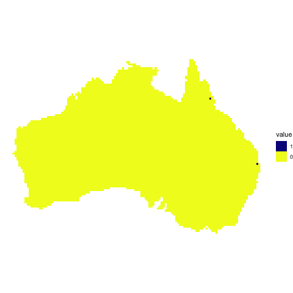

# DS4B-final-report

This repo was my final project for BIOL3207 at ANU. As part of the project I had to create the below poster, which explains the project.

I also made an animation that shows the progression of the cane toads across Northern Australia in my agent based model.

